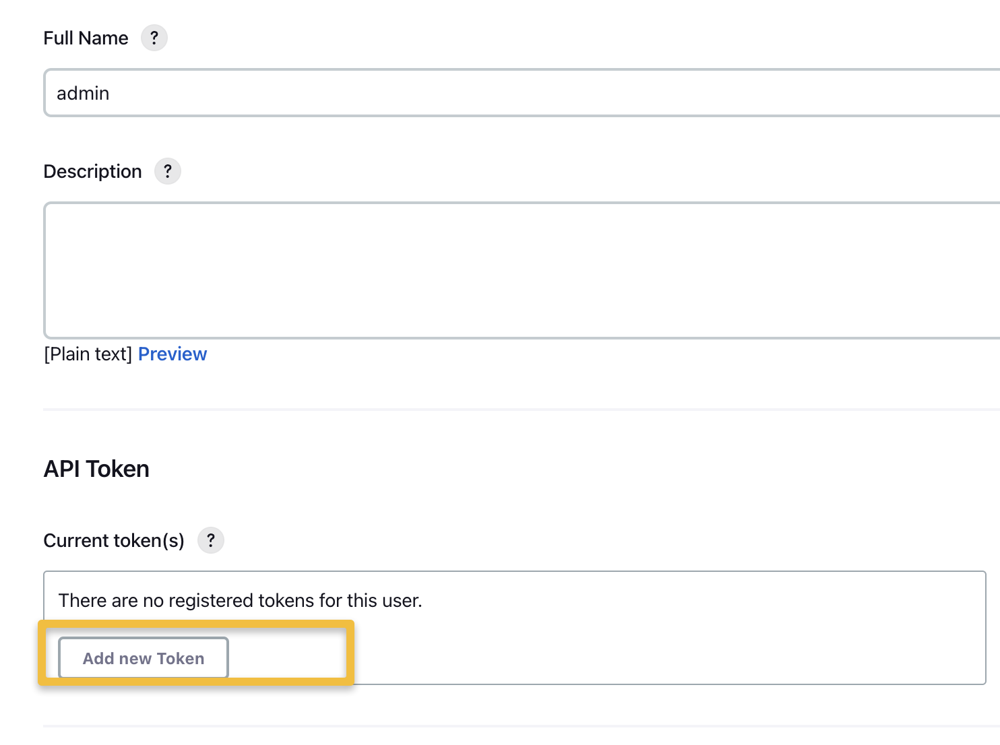

# Jenkins JCasc and Docker: Part 2

This is an advanced example showing how to:

1. Run Jenkins using Containers
2. Manage Jenkins using configuration as code (JCaSC)
3. Manage Jenkins Plugins as using configuration as code
4. Using dynamic Docker Containers as Build Agents

Prerequisites

- https://github.com/jvalentino/example-docker-jenkins
- https://github.com/jvalentino/example-jenkins-docker-jcasc

Build Agents

- Maven: https://github.com/jvalentino/jenkins-agent-maven (Docker Hub as `jvalentino2/jenkins-agent-maven`)
- Gradle: https://github.com/jvalentino/jenkins-agent-gradle (Docker Hub as `jvalentino2/jenkins-agent-gradle`)
- NPM: https://github.com/jvalentino/jenkins-agent-npm (Docker Hub as `jvalentino2/jenkins-agent-npm`)
- PYB (Python): https://github.com/jvalentino/jenkins-agent-pyb (Docker Hub as `jvalentino2/jenkins-agent-pyb`)

Example Projects using Build Agents:

- Gradle: https://github.com/jvalentino/example-java-gradle-jenkins-declarative-docker
- Maven: https://github.com/jvalentino/example-java-maven-jenkins-declarative-docker
- NPM (JavaScript): https://github.com/jvalentino/example-js-npm-jenkins-declarative-docker
- PYB (Python): https://github.com/jvalentino/example-python-pyb-jenkins-declarative-docker

# (1) Running Jenkins

You need to use the `--build` option to build the docker image, which is where the plugins are installed. This otherwise launches the Jenkins and Docker containers in detaced mode:

```bash
docker compose up --build -d
```

# (2) Modifying Configuration

Generally anything that you would normally modify through "Manage Jenkins" is now done via the Configuration as Code Plugin. I typicaly modify what I want as normal, look at the resulting configuration using http://localhost:8080/manage/configuration-as-code/viewExport, and then modify the `jcasc/jenkins.yml` file with the changes.

These changes can be immediately applied via "Reload existing Configuration" at http://localhost:8080/manage/configuration-as-code/, or by just restarting Jenkins.

# (3) Updating Plugins

The Jenkins CLI is used for managing plugins via `plugins/plugins.txt`:

```
configuration-as-code:1569.vb_72405b_80249
blueocean:1.26.0
docker-plugin:1.2.10
jacoco:3.3.2
warnings-ng:9.22.0
pipeline-maven:1257.v89e586d3c58c
```

This is just a list of the plugin ID and version to be installed. In order for these to by applied, you have to rebuild the docker image, which can be done by running `docker compose up --build -d`.

# (4) Advanced Admin

## API Token

For starters, you will need an API token.

http://localhost:8080/user/admin/configure



## Remote Access

Reference: https://www.jenkins.io/doc/book/managing/script-console/

The reason we setup this API Token, is to be able to access the Jenkins REST API. Specifically, we are wanted to remotely execute groovy code inside of the protected Jenkins JVM using the script console like so:

```bash
$ curl --user 'admin:11569583b710c400d317a6d4d93b2fe2f2' --data-urlencode "script=println 'hi'" http://localhost:8080/scriptText

hi
```

In this example:

- admin is the username
- 11569583b710c400d317a6d4d93b2fe2f2 is the API token
- `println 'hi'` is the Groovy code we are executing

Why? Because you can get the same information using Groovy scripting as from the various REST APIs themselves, without having to make potentially hundreds (or more) or REST calls.

## Using the Script Console

From http://localhost:8080/manage/script/

Running:

```groovy
Jenkins.instance.getAllItems(AbstractItem.class).each {
    println it.fullName + " - " + it.class
};
```

..for me results in a list of all my jobs and types:

```
docker-test - class hudson.model.FreeStyleProject
example-java-gradle-jenkins-declarative-docker - class org.jenkinsci.plugins.workflow.multibranch.WorkflowMultiBranchProject
example-java-gradle-jenkins-declarative-docker/main - class org.jenkinsci.plugins.workflow.job.WorkflowJob
example-java-maven-jenkins-declarative-docker - class org.jenkinsci.plugins.workflow.multibranch.WorkflowMultiBranchProject
example-java-maven-jenkins-declarative-docker/main - class org.jenkinsci.plugins.workflow.job.WorkflowJob
example-js-npm-jenkins-declarative-docker - class org.jenkinsci.plugins.workflow.multibranch.WorkflowMultiBranchProject
example-js-npm-jenkins-declarative-docker/main - class org.jenkinsci.plugins.workflow.job.WorkflowJob
example-python-pyb-jenkins-declarative-docker - class org.jenkinsci.plugins.workflow.multibranch.WorkflowMultiBranchProject
example-python-pyb-jenkins-declarative-docker/main - class org.jenkinsci.plugins.workflow.job.WorkflowJob
jenkins-agent-docker - class org.jenkinsci.plugins.workflow.multibranch.WorkflowMultiBranchProject
jenkins-agent-docker/main - class org.jenkinsci.plugins.workflow.job.WorkflowJob
jenkins-agent-gradle - class org.jenkinsci.plugins.workflow.multibranch.WorkflowMultiBranchProject
jenkins-agent-gradle/main - class org.jenkinsci.plugins.workflow.job.WorkflowJob
jenkins-agent-maven - class org.jenkinsci.plugins.workflow.multibranch.WorkflowMultiBranchProject
jenkins-agent-maven/main - class org.jenkinsci.plugins.workflow.job.WorkflowJob
jenkins-agent-npm - class org.jenkinsci.plugins.workflow.multibranch.WorkflowMultiBranchProject
jenkins-agent-npm/main - class org.jenkinsci.plugins.workflow.job.WorkflowJob
jenkins-agent-pyb - class org.jenkinsci.plugins.workflow.multibranch.WorkflowMultiBranchProject
jenkins-agent-pyb/main - class org.jenkinsci.plugins.workflow.job.WorkflowJob
```

This is the basis for writing a script to get all sorts of detailed information about every job on the Jenkins controller.

The best thing to do here is that instead of returning text, return JSON. This is so that you can make a REST call that returns this JSON, and then do something using code with the result. For example:

```groovy
import groovy.json.JsonBuilder

List jobs = [];
Jenkins.instance.getAllItems(AbstractItem.class).each {
    Map job = [ fullName: it.fullName, clazz: it.class.toString()]
    jobs.add(job)
}

println new JsonBuilder(jobs).toPrettyString()
```

...which now results in:

```json
[
    {
        "fullName": "docker-test",
        "clazz": "class hudson.model.FreeStyleProject"
    },
    {
        "fullName": "example-java-gradle-jenkins-declarative-docker",
        "clazz": "class org.jenkinsci.plugins.workflow.multibranch.WorkflowMultiBranchProject"
    },
    {
        "fullName": "example-java-gradle-jenkins-declarative-docker/main",
        "clazz": "class org.jenkinsci.plugins.workflow.job.WorkflowJob"
    },
    {
        "fullName": "example-java-maven-jenkins-declarative-docker",
        "clazz": "class org.jenkinsci.plugins.workflow.multibranch.WorkflowMultiBranchProject"
    },
    {
        "fullName": "example-java-maven-jenkins-declarative-docker/main",
        "clazz": "class org.jenkinsci.plugins.workflow.job.WorkflowJob"
    },
    {
        "fullName": "example-js-npm-jenkins-declarative-docker",
        "clazz": "class org.jenkinsci.plugins.workflow.multibranch.WorkflowMultiBranchProject"
    },
    {
        "fullName": "example-js-npm-jenkins-declarative-docker/main",
        "clazz": "class org.jenkinsci.plugins.workflow.job.WorkflowJob"
    },
    {
        "fullName": "example-python-pyb-jenkins-declarative-docker",
        "clazz": "class org.jenkinsci.plugins.workflow.multibranch.WorkflowMultiBranchProject"
    },
    {
        "fullName": "example-python-pyb-jenkins-declarative-docker/main",
        "clazz": "class org.jenkinsci.plugins.workflow.job.WorkflowJob"
    },
    {
        "fullName": "jenkins-agent-docker",
        "clazz": "class org.jenkinsci.plugins.workflow.multibranch.WorkflowMultiBranchProject"
    },
    {
        "fullName": "jenkins-agent-docker/main",
        "clazz": "class org.jenkinsci.plugins.workflow.job.WorkflowJob"
    },
    {
        "fullName": "jenkins-agent-gradle",
        "clazz": "class org.jenkinsci.plugins.workflow.multibranch.WorkflowMultiBranchProject"
    },
    {
        "fullName": "jenkins-agent-gradle/main",
        "clazz": "class org.jenkinsci.plugins.workflow.job.WorkflowJob"
    },
    {
        "fullName": "jenkins-agent-maven",
        "clazz": "class org.jenkinsci.plugins.workflow.multibranch.WorkflowMultiBranchProject"
    },
    {
        "fullName": "jenkins-agent-maven/main",
        "clazz": "class org.jenkinsci.plugins.workflow.job.WorkflowJob"
    },
    {
        "fullName": "jenkins-agent-npm",
        "clazz": "class org.jenkinsci.plugins.workflow.multibranch.WorkflowMultiBranchProject"
    },
    {
        "fullName": "jenkins-agent-npm/main",
        "clazz": "class org.jenkinsci.plugins.workflow.job.WorkflowJob"
    },
    {
        "fullName": "jenkins-agent-pyb",
        "clazz": "class org.jenkinsci.plugins.workflow.multibranch.WorkflowMultiBranchProject"
    },
    {
        "fullName": "jenkins-agent-pyb/main",
        "clazz": "class org.jenkinsci.plugins.workflow.job.WorkflowJob"
    }
]
```

You can see now that any language capable of executing a REST can use this API to get any information about anything on Jenkins.

## Operationalizing Information Gathering

TBD